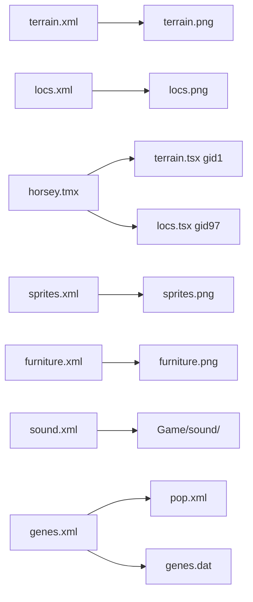

# Game data formats (`Game/data/`)

**Verification:** counts below come from `python RE_Tools/tools/scripts/inventory_data.py` on this tree (see `RE_Tools/analysis/data_inventory.json`).

**Repomix:** `repomix-output-DohmBoy64Bit-Horsey-Game.xml` is **reference only** — not source of truth. See [SOURCES.md](SOURCES.md).

**Audio:** `.ogg` / `.wav` referenced by `sound.xml` live under `Game/sound/` (not inventoried here).

---

## Inventory summary (49 files in `data/`)

| Category | Files | Verified by |
|----------|-------|-------------|
| TextureAtlas XML + PNG | 6 pairs + biglogo | `texture_atlas.py` |
| World map | `horsey.tmx` | `tiled_map.py` |
| Genetics | `genes.xml`, `pop.xml`, `genes.dat` | parsers + hex header |
| Audio defs | `sound.xml` | `sound.py` |
| BMFont text | 4× `.txt` | `bmfont_txt.py` |
| Compiled fonts | 5× `.crf` | magic bytes only |
| Horse names | `names.txt` | line count |
| Loose images | posters, UI, etc. | size only |

Regenerate: `python RE_Tools/tools/scripts/inventory_data.py`

---

## 1. TextureAtlas XML (`terrain.xml`, `locs.xml`, `veg.xml`, `sprites.xml`, `furniture.xml`, `biglogo.xml`)

**Root:** `<TextureAtlas>`  
**Children:** `<sprite n="..." x="..." y="..." w="..." h="..." .../>`

| Attribute | Meaning |
|-----------|---------|
| `n` | Sprite name (game logic / Tiled) |
| `x`, `y` | Top-left in companion `.png` |
| `w`, `h` | Size in pixels |
| `c` | Optional animation frame count |
| `hx`, `hy` | Optional hotspot (pivot), may be fractional |

**Verified sprite counts (this build):**

| File | Sprites | Companion image |
|------|---------|-----------------|
| `terrain.xml` | **42** | `terrain.png` |
| `locs.xml` | **34** | `locs.png` |
| `veg.xml` | **7** | `veg.png` |
| `sprites.xml` | **294** | `sprites.png` |
| `furniture.xml` | **137** | `furniture.png` |
| `biglogo.xml` | **2** (`LogoHorsey`, `LogoGame`) | `biglogo.png` |

**Example** (`terrain.xml`):

```xml
<sprite n="Plain" x="0" y="0" w="32" h="32" c="4"/>
```

---

## 2. `horsey.tmx` (Tiled map)

**Format:** Tiled TMX 1.1, orthogonal, CSV layer data.

**Verified (parser):**

| Property | Value |
|----------|--------|
| Size | **400 × 225** tiles |
| Tile size | **32 × 32** px |
| Layers | **1** — `Tiles` |
| Tile count | **90,000** GIDs |
| Unique GIDs | **56** |
| GID 0 | **0** (empty not used; terrain starts at 1) |
| Tilesets | `terrain.tsx` firstgid=**1**, `locs.tsx` firstgid=**97** |

**Top GIDs by frequency (verified):** 9 → **Stump** (60950), 1 → **Plain** (17137), 5 → **CactusLand** (8061), …

**GID → sprite (verified):**  
`python RE_Tools/tools/scripts/map_tile_gids.py` → `RE_Tools/analysis/tile_gid_map.json` / `.txt`

| Rule | Source |
|------|--------|
| `local_id = gid - first_gid` | Tiled TMX `horsey.tmx` tilesets |
| Sprite name = `terrain.xml` or `locs.xml` sprite list `[local_id]` | `texture_atlas.py` document order |
| GID 1 → `Plain`, GID 9 → `Stump`, GID 97 → `LocStable` | Output of `map_tile_gids.py` on this tree |

**Example** (`terrain.xml` index 8 = `Stump`, firstgid 1 → GID 9):

```
gid=9, tileset=terrain.tsx, local_id=8, sprite=Stump, count=60950
```

**Mod / SDK consumer:** `minimap_mod` + `horse_map_load_tmx` render this **static** layout (not per-save farm state). See [MinimapMod.md](MinimapMod.md). Live view XY: [MapViewPosition.md](MapViewPosition.md).

**Note:** `terrain.tsx` / `locs.tsx` are referenced in TMX but **not present** under `Game/` in this workspace (string search in `Horsey.exe` also negative). Atlases are loaded from `terrain.xml` / `locs.xml` directly.

---

## 3. `genes.xml`

**Root:** `<exp>`  
**Children:** `<gene name="..." m="..." s="..." g0="..." g1="..." g2="..." g3="..." n="...."/>`

| Attribute | Role (semantic — confirm in Ghidra) |
|-----------|--------------------------------------|
| `name` | Gene id (matches `pop.xml`) |
| `m` | Mutation rate (observed 50–100) |
| `s` | Scale (often 100; sometimes 1 for flags) |
| `g0`–`g3` | Expression channels |
| `n` | 4-letter code (G/A/T/C style) |

**Verified:** **240** genes.

---

## 4. `pop.xml`

**Root:** `<pops>`  
**Structure:** nested `<pop name="...">` with `<gene name="..." p0="..." p1="..." .../>` overrides.

**Verified:** **23** variants:  
`default`, `scratch`, `fest horse`, `impala`, `alligator`, `giraffe`, `rabbit`, `duck`, `dino`, `centipede`, `tiger`, `moose`, `dachshund`, `bear`, `cow`, `human`, `car`, `appletree`, `yeast`, `hay`, `fish`, `helix`, `freak`.

---

## 5. `genes.dat` (binary)

**Verified** (3507 bytes, parser `genes_dat.py`):

| Offset | Type | Value / meaning |
|--------|------|-----------------|
| 0x00 | u32 | `240` — gene count (matches `genes.xml`) |
| 0x04 | u32 | `4` — byte length of **first** gene name (`SIZE`) |
| 0x08+ | records | Same **name order** as `genes.xml` |

**Per-record layout** (genes `0 … n-2`):

```
[ascii name, length = previous u32 or header u32 for gene 0]
[u32 = byte length of NEXT gene name]
```

**Last gene** (`LOCO_SYNC`): name only, **no** trailing u32.

**Example** (hex at file start):

```
f0 00 00 00   ; count 240
04 00 00 00   ; first name len 4
53 49 5A 45   ; "SIZE"
06 00 00 00   ; next name len 6 → "ASPECT"
...
```

**Exe xref** (`Horsey.exe` string scan): `genes.dat` @ `0x263920`, `genes.xml` @ `0x263930`.

**Not in file:** mutation rates / `g0`–`g3` — those remain in `genes.xml` only; `.dat` is a **name index** for the runtime.

---

## 6. `sound.xml`

**Root:** `<Sounds>`  
**Children:** `<music n="..." f="..."/>` and `<sound n="..." f="..." vol="..." pitch="..." .../>`

| Attribute | Meaning |
|-----------|---------|
| `n` | Event name (code must match) |
| `f` | Path under `Game/sound/` (`.ogg` / `.wav`) |
| `vol`, `pitch`, `pitchlow`, `pitchhigh` | Optional |

**Verified:** **23** music, **476** sound events.

**Audio files:** `python RE_Tools/tools/scripts/verify_sound_paths.py` — all **393** unique `f=` basenames resolve under `Game/sound/` (paths in XML are filename-only, not `sound/` prefixed).

---

## 7. BMFont text (`.txt`)

AngelCode BMFont **text** export (human-readable metrics). Paired with `.png` atlas in `data/`.

**Verified files:**

| File | Font name | size | char_count | kerning_count |
|------|-----------|------|------------|---------------|
| `bubbletime.txt` | ChevyRay - Bubble Time | 21 | 95 | 11 |
| `classified.txt` | ChevyRay - Classified | 16 | 95 | 602 |
| `picory.txt` | ChevyRay - Picory | 16 | 95 | 39 |
| `softsquare.txt` | ChevyRay - Softsquare Wide | 9 | 95 | 22 |

Common keys: `name`, `size`, `ascent`, `descent`, `char_count`, `chars`, `advance`, `offset_x`, `offset_y`, `width`, `height`, `pack_x`, `pack_y`, `kerning`.

---

## 8. `.crf` (compiled font)

**Format:** Binary — **not** BMFont text. Paired with same-stem `.png` in `data/` (no `.txt`).

**Parsers:** `crf_font.py` · **Probe:** `analyze_crf.py` → `analysis/crf_probe.json`

**Verified container layout** (all 6 `.crf` files; `section1_bytes` at offset `0x08`):

| Offset | Size | Field |
|--------|------|--------|
| 0x00 | 4 | `u8[4]` tag — `[01, byte1, byte2, 03\|06]` (byte1 ≈ line height; byte3 often `03` like BMF v3) |
| 0x04 | 4 | `u32` — `177` or `185` (purpose **UNVERIFIED**) |
| 0x08 | 4 | `u32` **section1_bytes** — length of bytes after 16-byte header |
| 0x0C | 4 | `u32` — high constant bits + `0x07` low byte (**UNVERIFIED**) |
| 0x10 | `section1_bytes` | Section 1 — glyph opcode stream (`07 00 f9`, `09 00 f8`, …) |
| rest | — | Section 2 — secondary blob (often `uint16`-like tables, e.g. `563aff56…`) |

**Example** (`quip.crf`, 18948 bytes): `section1_bytes=5840` → section 1 = `[0x10..0x16E0)`, section 2 = 13092 bytes.

| File | section1 | section2 | hdr byte1 (guess px) |
|------|----------|----------|----------------------|
| `quip.crf` | 5840 | 13092 | 14 (`0x0e`) |
| `virtue_narrow_bold.crf` | 2831 | 7138 | 12 |
| `habit_narrow_bold.crf` | 2225 | 5926 | 11 |
| `snuggle.crf` | 2623 | 6658 | 12 |
| `capy_bold.crf` | 2432 | 6340 | 13 |
| `habit_mono.crf` | 0 | 1412 | 11 (byte3=`06`) |

**Exe xref** (`xref_data_strings.py`): each `*.crf` filename @ `0x263138`–`0x2631D0`; generic `".crf"` @ `0x968E2`.

**Section 1 opcodes (partial):** `crf_opcode_trace.py` — records delimited by prefixes `09 00 f8`, `07 00 f9`, `06 07 00`, etc. (`quip.crf`: 109 records). **Semantics UNVERIFIED.**

**Section 2:** binary tables (head often `ff31d0ff…` or opcode stream when `section1_bytes=0` e.g. `habit_mono.crf`).

---

## 9. `names.txt`

**Format:** UTF-8 text, **one display name per line**.

**Verified:** **5000** non-empty lines.

---

## 10. Loose images (no XML in `data/`)

Present in inventory; role inferred from filename only (**UNVERIFIED** in code):

| File | Bytes | Notes |
|------|-------|-------|
| `biglogo2.png` | 77130 | No `biglogo2.xml` |
| `bubbletime.png` | 7126 | Font atlas for `bubbletime.txt` |
| `capy_bold.png` | 3862 | Font; `.crf` present |
| `classified.png` | 3427 | |
| `clop.png` | 12985 | |
| `filmset.png` | 11892 | |
| `info.png` | 9199 | |
| `island.png` | 80204 | |
| `poster.jpg` / `poster2.jpg` | 53KB / 420KB | |
| `powerplant.jpg` | 328KB | |
| `treasuremap.png` | 8002 | |

---

## 11. `n64.fnt` (AngelCode BMF binary)

**Magic:** `BMF` + version byte `0x03` (AngelCode binary v3).

**Parser:** `bmf_binary.py` · **Verified on** `Game/data/n64.fnt`:

| Field | Value |
|-------|--------|
| Face | `Amiga Forever` |
| `fontSize` | -8 (BMFont info block) |
| `lineHeight` / `base` | 12 / 9 |
| Atlas size | 128×128 |
| Glyphs | **189** |
| Page string in file | `c64_0.png` |
| PNG on disk | `n64_0.png` (**name mismatch**) |

**Exe xref** (`xref_data_strings.py` / `phase1_pointer_xrefs.py`):

| String | In `Horsey.exe`? |
|--------|------------------|
| `n64.fnt` | yes @ `0x2658A8` |
| `n64_0.png` | yes @ `0x265A80` |
| `c64_0.png` | **no** — only inside BMF page block in `n64.fnt` |

Runtime likely uses **`n64_0.png`** (exe string); BMF page name is stale/wrong in asset.

**vs `.crf`:** UI fonts use `.crf` + `.png`; `n64.fnt` is standard BMF binary + `n64_0.png` (retro/UI glyph set). Loader choice: **UNVERIFIED** (Ghidra).

---

## Dependency graph (verified XML/TMX links)



---

## 12. Exe string xrefs (`data/` + `save/`)

**Script:** `xref_data_strings.py` → `analysis/data_exe_xrefs.json`

Substring search in `Horsey.exe` (not full xref graph). **42 / 53** filenames hit; common misses are **XML atlas paths** (`terrain.xml`, `sprites.xml`, …) — game likely builds paths as `data\\` + stem or loads PNGs directly.

**Referenced examples:** `genes.dat`, `horsey.tmx`, `quip.crf`, `n64.fnt`, `settings.xml` (in `save/`).

---

## Analysis scripts

| Script | Output |
|--------|--------|
| `inventory_data.py` | `analysis/data_inventory.json` |
| `map_tile_gids.py` | `analysis/tile_gid_map.json` / `.txt` |
| `analyze_crf.py` | `analysis/crf_probe.json` |
| `xref_data_strings.py` | `analysis/data_exe_xrefs.json` |
| `verify_sound_paths.py` | `analysis/sound_path_verify.json` |
| `parsers/genes_dat.py` | `genes.dat` name index |
| `parsers/bmf_binary.py` | `n64.fnt` (BMF v3) |
| `parsers/crf_font.py` | `.crf` section split |

## Data track — still open before Phase 1 exe

- [x] GID→sprite, `genes.dat`, sound paths, `.crf` **container**, `n64.fnt` BMF blocks, exe string xrefs  
- [ ] `.crf` section 1 opcode / section 2 tables (Ghidra)  
- [ ] `n64.fnt` page name `c64_0.png` vs `n64_0.png` at runtime  
- [ ] `terrain.tsx` / `locs.tsx` (absent on disk; low priority)  
- [ ] Loose images without exe strings (`biglogo2.png`, …) — dynamic load only  
