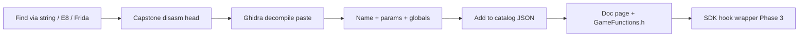

# Game function catalog (Phase 2)

**Goal:** Every **game-specific** routine in `Game/Horsey.exe` gets a stable name, verified **RVA**, optional **VA**, struct **offsets**, calling convention, and links to disasm/decompile — so the mod SDK can hook or call them without re-RE.

**Not in scope:** SDL/OpenGL/Steam exports (use module + symbol). Only `Horsey.exe` text.

**Image base:** `0x140000000` · **RVA → VA:** `0x140000000 + RVA`

---

## Deliverables

| Artifact | Purpose |
|----------|---------|
| [game_function_catalog.json](../analysis/game_function_catalog.json) | Machine-readable master list (hooks, code gen, CI) |
| [GameFunctions.h](GameFunctions.h) | C/C++ `HORSE_RVA_*` + hook typedefs for SDK/mods |
| [ghidra_exports/](ghidra_exports/) | Optional Ghidra decompiler paste per function |
| `RE_Tools/analysis/disasm_<name>.txt` | Capstone head disasm (from `disasm_catalog_function.py`) |
| Per-domain docs | e.g. [GameLoop.md](GameLoop.md), [Save_Write.md](Save_Write.md), [RaceMechanics.md](RaceMechanics.md) |

**Regenerate catalog:**

```bat
python RE_Tools\tools\scripts\build_game_function_catalog.py
python RE_Tools\tools\scripts\disasm_catalog_function.py --all-known
```

---

## Entry schema (`game_function_catalog.json`)

Each function object:

| Field | Required | Description |
|-------|----------|-------------|
| `id` | yes | Stable snake_case id (`save_write`) |
| `name` | yes | Human name (`Save_Write`) — matches Ghidra label when possible |
| `rva` | yes | Hex string `0x6DAB0` |
| `va` | auto | `0x140000000 + rva` |
| `category` | yes | `loop`, `save`, `io`, `settings`, `world`, `render`, `font`, `genetics`, `nested`, `other` |
| `status` | yes | `verified` \| `partial` \| `stub` |
| `summary` | yes | One-line behavior |
| `calling_convention` | yes | `microsoft_x64` (default) |
| `parameters` | no | `[{ "reg": "rcx", "type": "void*", "name": "ctx" }]` |
| `returns` | no | `{ "reg": "rax", "type": "int" }` |
| `globals` | no | `[{ "rva": "0x313720", "name": "g_game_state" }]` |
| `struct_offsets` | no | `{ "ctx+0x298": "SaveRow13 field A" }` — only when evidenced |
| `callers` | no | List of RVAs |
| `callees` | no | List of RVAs |
| `pair_read_rva` | no | Save I/O read twin |
| `hook` | no | `{ "safe_pre_call": true, "notes": "..." }` |
| `doc` | no | Relative path under `RE_Tools/docs/` |
| `decompile` | no | `ghidra_exports/*.c.txt` |
| `disasm` | no | `analysis/disasm_*.txt` |
| `verification` | yes | `["capstone","frida","ghidra"]` subset |

**Rules (same as [SOURCES.md](SOURCES.md)):**

1. No guessed RVAs — Capstone on exe, Frida hit, or Ghidra export.
2. Offsets on live objects require disasm or trace (e.g. `SaveContext.h`, not repomix).
3. Mark `stub` until decompile + one dynamic trace exist; then promote to `verified`.

---

## Workflow per function



1. **Locate** — string xref, `phase1_verify.py` E8 edges, or Frida backtrace.
2. **Disasm** — `disasm_catalog_function.py --rva 0x6DAB0 --name Save_Write`
3. **Decompile** — paste to `ghidra_exports/<Name>.c.txt` ([Ghidra_User_Tasks.md](Ghidra_User_Tasks.md))
4. **Describe** — rcx/rsi globals, struct offsets used in body.
5. **Register** — add to seed in `build_game_function_catalog.py` or `catalog_seed.json`
6. **Verify** — Frida hook once; set `status: verified`

---

## Gameplay (race / shop / spawn)

Discovered via **string literal xrefs** in `.rdata` — see [GameplayFunctions.md](GameplayFunctions.md).

```bat
python RE_Tools\tools\scripts\find_gameplay_functions.py
python RE_Tools\tools\scripts\build_game_function_catalog.py --gameplay
```

| Entry RVA | Name | Role |
|-----------|------|------|
| `0x10AB80` | **GainMoney** | `[ctx+0x308] += amount` (Ghidra verified) |
| `0x33A20` | **SimSpawnDisk** | Spawn FSM entry (`SimSpawnDisk` string @ `0x342F0`) |
| `0x787D0` | **BuyItem** | Shop buy dispatch |
| `0x8F2B0` | **RaceStateMachine** | Race UI FSM (RaceGo string @ `0x91274` inside) |
| `0x5E0C2` | **SimMessageDispatch** | Sim tag hub; **SimStartRace** tag @ `0x5F372` — [SimStartRace.md](SimStartRace.md) |

**Frida validation:** `python RE_Tools/tools/scripts/frida_gameplay_hooks.py --attach --seconds 120`

Strings also name: `Betting`, `BetMore`, `HorseMart`, `GrabHorse`, `Studs`, …

---

## Categories (coverage targets)

| Category | Examples | Doc hub |
|----------|----------|---------|
| `loop` | `GameMain_InitAndLoop`, `Game_DispatchSdlEvent`, `Game_UpdateWorld` | [GameLoop.md](GameLoop.md) |
| `race` / `shop` / `spawn` | `GainMoney`, `SimSpawnDisk`, `BuyItem` | [GameplayFunctions.md](GameplayFunctions.md) |
| `save` | `Save_Write`, `Save_Load`, stream writers | [Save_Write.md](Save_Write.md), [SaveLoadPath.md](SaveLoadPath.md) |
| `io` | `WriteU32`, `ReadU32`, `WriteNestedSave` | [save_read_write_pairs.json](../analysis/save_read_write_pairs.json) |
| `nested` | `WriteNestedItem`, b8 `vtable+0x48` handlers | [SaveNestedFormat.md](SaveNestedFormat.md) |
| `settings` | `SettingsLoader`, `Settings_Save` | [SettingsLoader.md](SettingsLoader.md) |
| `world` | `Game_WorldSimStep`, `Game_BootstrapWorld` | [Game_WorldSimStep.md](Game_WorldSimStep.md) |
| `font` | `Font_LoadOrInit`, CRF VM | [FontLoad.md](FontLoad.md) |
| `genetics` | `GeneticsApply` @ `0xAE470` | [SaveFutureWork.md](SaveFutureWork.md) |
| `shutdown` | Quit chain, autosave callers | [QuitSaveTrace.md](QuitSaveTrace.md) |

**Progress:** see `summary` block in `game_function_catalog.json` (`verified_count` / `total`).

---

## SDK consumption (Phase 3+)

Mods and `SDK/` link against **`GameFunctions.h`**:

```c
#include "horse/GameFunctions.h"

// Runtime: module base + RVA (ASLR-safe)
void *base = GetModuleHandleA("Horsey.exe");
void *save_write = (uint8_t *)base + HORSE_RVA_Save_Write;
```

Hook helpers (Phase 3 mod loader) use the same RVAs plus catalog `parameters` / `calling_convention` for typed trampolines.

**Do not** hardcode RVAs in mod code — include generated header from this catalog only.

---

## Related

- [Ghidra_Phase1.md](Ghidra_Phase1.md) — manual RE tasks
- [SaveGhidraCrossref.md](SaveGhidraCrossref.md) — save read/write pairs
- [ReverseEngineeringProgress.md](ReverseEngineeringProgress.md) — changelog
